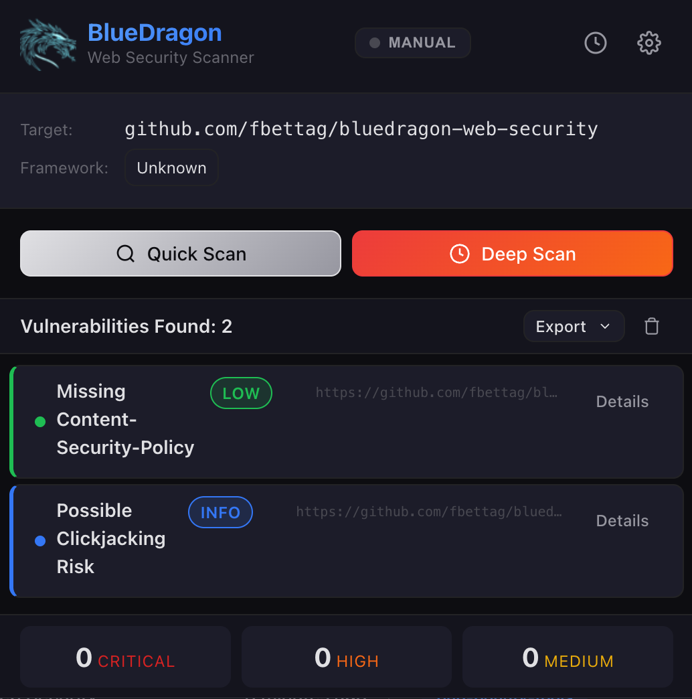
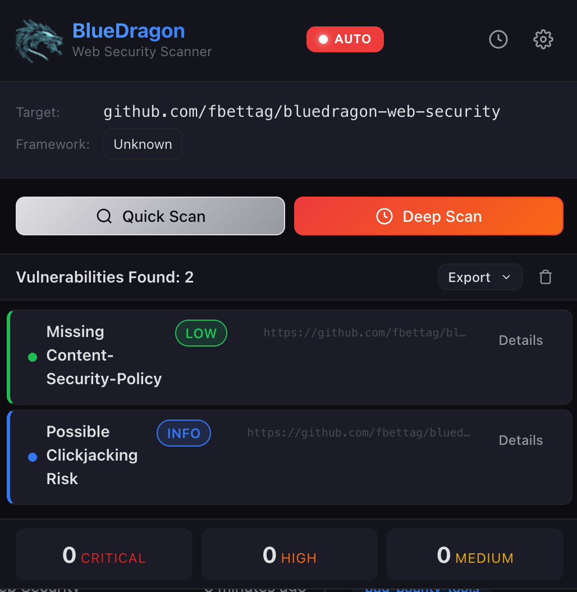

# BlueDragon Web Security

> An advanced web vulnerability scanner for modern SSR frameworks.

[](https://opensource.org/licenses/MIT)
[](https://developer.chrome.com/docs/extensions/)
[](https://developer.chrome.com/docs/extensions/mv3/intro/)

## Overview

BlueDragon is a security research tool for bug bounty hunters and red teamers. It automatically detects and safely exploits vulnerabilities in modern SSR frameworks including React/Next.js, Angular, SvelteKit, and Nuxt/Vue.

> **IMPORTANT**: This tool is intended for **authorized security testing only**. Users must obtain proper authorization before testing any systems they do not own or have explicit permission to test.

## Screenshots

<table>
  <tr>
    <td align="center"><b>Manual Scan</b></td>
    <td align="center"><b>Auto Scan Mode</b></td>
  </tr>
  <tr>
    <td></td>
    <td></td>
  </tr>
</table>

## Features

### Framework Detection
- **Auto-Detection**: Identifies React, Next.js, Angular, SvelteKit, Nuxt, Vue.
- **Version Fingerprinting**: Extracts framework versions from page assets.
- **RSC Detection**: Identifies React Server Components and SSR patterns.
- **Build Analysis**: Detects development vs production builds.

### Vulnerability Scanning
- **CVE Database**: 18+ known vulnerabilities across frameworks.
- **Version Matching**: Checks detected versions against vulnerable ranges.
- **Safe Probing**: Non-destructive validation of potential vulnerabilities.
- **CVSS Scoring**: Severity ratings for prioritization.

### Safe Exploitation
- **Timing Oracles**: Non-destructive timing-based detection.
- **DNS Exfiltration**: Out-of-band validation via Burp Collaborator/Interactsh.
- **Rate Limiting**: Max 5 requests/second per domain.
- **Endpoint Blocklist**: Never probes payment/billing endpoints.

### Scan Modes
- **Manual Scan**: On-demand vulnerability assessment.
- **Deep Scan**: Comprehensive analysis with safe exploitation.
- **Auto Scan**: Background scanning while browsing (configurable).

## Quick Start

### Prerequisites
- Google Chrome (v110+)
- Node.js (v18+) for building

### Installation

#### Method 1: Build from Source (Recommended)
```bash
# Clone the repository
git clone https://github.com/fbettag/bluedragon-web-security.git
cd bluedragon-web-security

# Install dependencies and build
npm install
npm run build
```

#### Method 2: Load in Chrome
1. Open `chrome://extensions/`
2. Enable "Developer mode"
3. Click "Load unpacked"
4. Select the `dist` folder

## Usage Guide

1. **Navigate**: Visit any web application you're authorized to test.
2. **Detect**: BlueDragon automatically identifies the framework.
3. **Scan**: Click "Quick Scan" or "Deep Scan" to find vulnerabilities.
4. **Review**: Examine findings with CVE details and severity.
5. **Export**: Download as JSON, Markdown, or Nuclei templates.

### Scan Modes

| Mode | Trigger | Scope |
|------|---------|-------|
| **Manual** | Click "Quick Scan" | Fast vulnerability detection |
| **Deep** | Click "Deep Scan" | Comprehensive analysis with safe probes |
| **Auto** | Page load | Background scanning (configurable) |

## Technical Specifications

### Supported CVEs

#### React / Next.js
| CVE | Severity | Description |
|-----|----------|-------------|
| CVE-2025-29927 | CRITICAL | Middleware authorization bypass |
| CVE-2024-34351 | HIGH | Server Action SSRF via Host header |
| CVE-2024-47831 | MEDIUM | Image optimization DoS |

#### Angular
| CVE | Severity | Description |
|-----|----------|-------------|
| CVE-2025-62427 | HIGH | SSR SSRF via double-slash injection |
| CVE-2025-59052 | HIGH | SSR race condition data leak |
| CVE-2025-66412 | MEDIUM | Stored XSS via hydration state |

#### SvelteKit
| CVE | Severity | Description |
|-----|----------|-------------|
| CVE-2023-29008 | MEDIUM | CSRF bypass via Content-Type |
| CVE-2024-53262 | MEDIUM | Template XSS on error pages |
| CVE-2025-32388 | MEDIUM | searchParams XSS via goto() |

#### Nuxt / Vue
| CVE | Severity | Description |
|-----|----------|-------------|
| CVE-2024-23657 | CRITICAL | Devtools RCE via path traversal |
| CVE-2024-34344 | CRITICAL | TestComponentWrapper RCE |
| CVE-2023-3224 | CRITICAL | Dev server code injection |

### Supported Frameworks
- **Next.js** (v11.1.4+)
- **React** (v19+ with RSC)
- **Angular** (v16+)
- **SvelteKit** (v1+)
- **Nuxt** (v3+)
- **Vue.js** (v3+)
- **Remix**, **Astro**, **Waku**, **RedwoodJS**

### File Structure
```
dist/                   # Built extension (load this in Chrome)
src/
  popup/                # Extension popup UI
  settings/             # Configuration page
  history/              # Findings history and export
  content/              # Content script - framework detection
  background/           # Service worker
  shared/               # CVE database, constants
  scanners/             # Framework-specific scanners
  exploits/             # Safe exploitation modules
icons/                  # Extension icons
```

## Support

- **Issues**: [GitHub Issues](https://github.com/fbettag/bluedragon-web-security/issues) for bug reports.
- **Discussions**: [GitHub Discussions](https://github.com/fbettag/bluedragon-web-security/discussions) for questions.

## License

This project is licensed under the **MIT License**.
